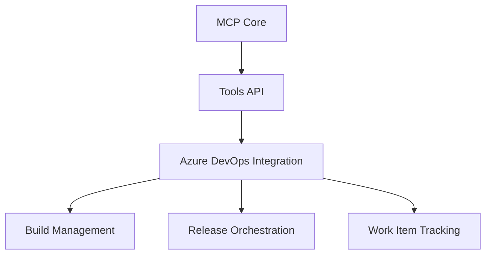

# Azure DevOps MCP: Сервер управления CI/CD процессами

## Обзор проекта
Проект azure-devops-mcp предоставляет серверную инфраструктуру для централизованного управления конвейерами CI/CD в экосистеме Azure DevOps. Решение реализовано как TypeScript-приложение с поддержкой Docker-контейнеризации.

**Ключевые характеристики:**
- Единая точка управления пайплайнами
- Интеграция с Azure DevOps REST API
- Поддержка модульной архитектуры инструментов
- Автоматизация развертывания в различных средах

## Архитектурные компоненты

Основные модули:
1. **Ядро системы (Core)**
   - Обработка запросов
   - Маршрутизация команд
   - Управление конфигурацией

2. **Интеграционный слой**
   - REST-клиент для Azure DevOps
   - Аутентификация через OAuth 2.0
   - Поддержка Service Principal

3. **Инструментарий DevOps**
   - Управление сборками (Builds)
   - Оркестрация релизов (Releases)
   - Мониторинг тестовых прогонов (Test Plans)

## Основные функции
| Категория          | Возможности                                                                 |
|---------------------|-----------------------------------------------------------------------------|
| Автоматизация сборок | Триггеры по событиям, Параллельные выполнения, Кастомные условия срабатывания |
| Управление релизами  | Blue/Green развертывание, Канареечные релизы, Автоматический откат           |
| Интеграция          | Webhooks, Service Hooks, Поддержка кастомных скриптов                        |
| Безопасность        | RBAC, Шифрование секретов, Аудит действий                                    |

## Документация
- [Техническая спецификация](docs/SPECIFICATION.md)
- [Архитектурные решения](docs/ARCHITECTURE.md)
- [Политики безопасности](SECURITY.md)

**Системные требования:**
- Node.js 18+
- Docker 23+
- Доступ к Azure DevOps Organization
